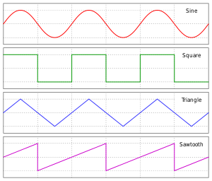
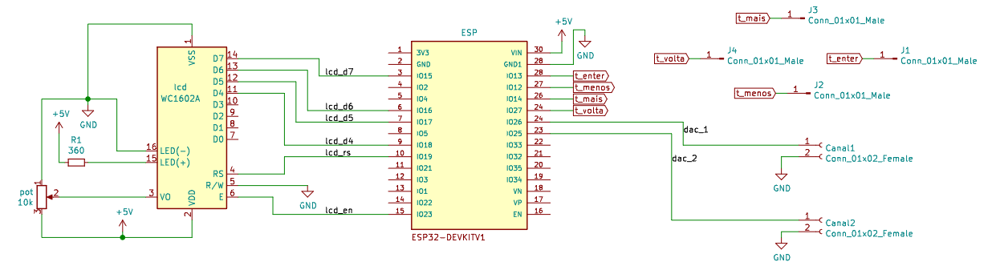

# Gerador de Funções com ESP32

### Resumo

Este projeto implementa um gerador de funções num ESP32. Podendo gerar ondas de saída como: 
 * Seno
 * Onda-Quadrada
 * Onda-Triangular
 * Dente-de-serra

Podemos ajustar os parâmetros dessas ondas, como Amplitude, Offset e Frequência. Porém a escolha nos valores de amplitude e Offset deve respeitar os limites
de operação do ESP32, de modo que a onda resultante fique entre 3.3V e 0V. E frequência suportada é em torno de 1Hz a 100Hz. 

### Esquemático do Hardware 

Como podemos ver na imagem, são usados os conversores DAC como saída do sistema. E para interação do usuário são usados 4 botões touch e um display 16x2.

### Software

O código foi escrito no VSCode, com auxílio da Extensão [PlatformIO](https://docs.platformio.org/en/latest/integration/ide/vscode.html). Usando Framework Arduíno e a Placa ESP32 DEV module.

### Funcionamento

Para mostrar o funcionamento do sistema foi criado um berve vídeo mostrando a interação do sistema com o usuário: [Gerador de Funções com ESP32](https://www.youtube.com/watch?v=BvxLr3R67Lg "Gerador de Funções com ESP32")

